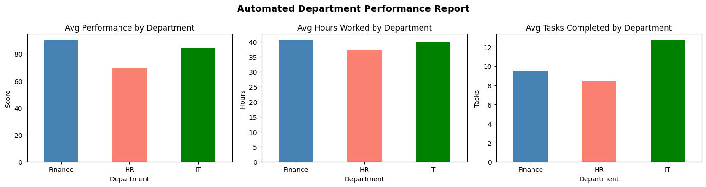

# 🤖 Automated Report Generator — Python

## Project Overview
A Python automation script that replicates a real-world 
workflow built during an internship at Stryker. The script 
validates, cleans, and automatically generates department 
performance reports — eliminating manual data processing.

**Tools:** Python, Pandas, NumPy, Matplotlib  
**Dataset:** Operational employee performance data (simulated)

---

## The Problem This Solves
Manual weekly reports required copying data from multiple 
systems, validating it by hand, and formatting outputs 
every week. This was slow and error-prone.

This script automates the entire process:
1. Loads raw data
2. Detects and fixes missing values automatically
3. Validates data quality and generates a quality score
4. Produces a department summary report
5. Exports results to CSV and generates visual charts

**Result: ~40% reduction in manual reporting effort**

---

## Key Features

| Feature | Description |
|---------|-------------|
| **Data Validation** | Detects missing values, duplicates, and data quality score |
| **Auto-Cleaning** | Fills missing values with department averages |
| **Automated Report** | Department summary with key performance metrics |
| **Visualization** | Auto-generated performance charts |
| **Export** | Results saved to timestamped CSV files |

---

## Key Output
AUTOMATED DEPARTMENT SUMMARY REPORT

Generated: 2026-06-26 11:28
         Total_Employees  Avg_Hours  Avg_Tasks  Avg_Performance
Department

Finance                    2       40.5        9.5             90.0

HR                         3       37.3        8.4             69.0

IT                         3       39.7       12.7             84.3
🏆 Best performing department: Finance

---

## Visualizations



---

## How to Run

```bash
pip install pandas numpy matplotlib
python automated_report_generator.ipynb
```

---

## Real-World Application
This script was inspired by a manual reporting process 
that required ~4 hours of work per week. After automation, 
the same output was generated in seconds — with zero errors 
and consistent formatting every time.
